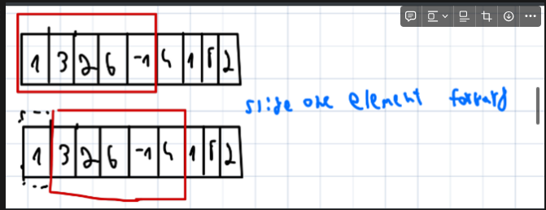

1. ## Sliding Window (window (subarray or substring) and adjust its size dynamically )


identify the pattern

- the input is **liner** **Data structure.**
- longest/shortest substring or subarray, largest sun, max sum and etc.

Common Leetcode Questions:

- max subarray of size K - easy
- longest substring - medium
- string anagram - hard

for example, here is a c# code snippest for finding max sum of subarray from size K

complexity: o(n \* k )

```csharp
using System;

class Solution
{
  // return max sum of subarray of size k
  static int MaxSum(int[] arr, int n, int k)
  {
    //intiallize result
    int maxSum = int.MinValue;
    //consider all blocks starting with i
    for(int i = 0; i< n- k + 1 ; i++) // we want subarray size K,
    {
		 // intiallize for every new subarray
      int currenctSum = 0;
      for(int j = 0 ; j < k ; j++)
            currenctSum = currenctSum + arr[i+j];
      //update result if requred
      maxSum = Math.Max(currentSum, maxSum)
    }
    return maxSum;
  }
}
```

dynamic window size for a valid window to sum actions:

```python
    def characterReplacementImproved(self, s: str, k: int) -> int:
        char_count_dict = {}
        left, valid_window_size , res = 0,0,0
        for right in range(len(s)):
            char_count_dict[s[right]] = 1 + char_count_dict.get(s[right], 0)
            max_char_frequent = max(char_count_dict[s[right]], max_char_frequent)
            window_size = (right - left + 1)
            # Calculation for a valid window size
            valid_window_size = window_size  - max_char_frequent
            if valid_window_size > k:
                char_count_dict[s[left]] -= 1
                left += 1
            res = max(res, window_size)
        return res
```


