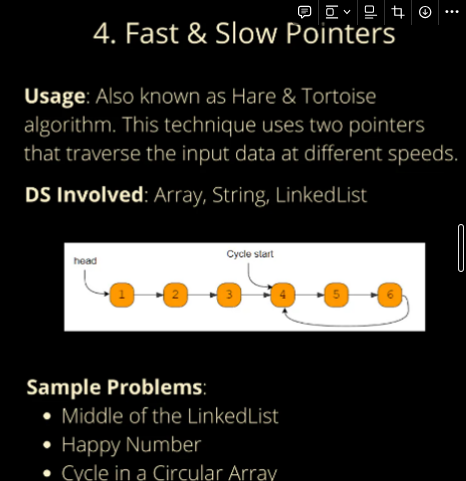
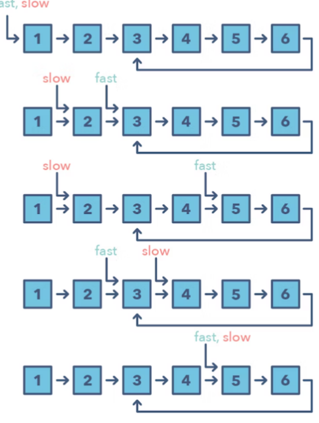

# 3. Fast and Slow Pointers : (cycles and middle of linked list mostly)



also knows as **Hare & tortoise algorithm**, the algo proves that the two pointers are bound to meet. the fast pointer should catch the slow pointer once both of them are in cyclic loop.

### **identify**

- the problem will deal with a loops in linked list or array
- when you need to know the position of a certain element or overall length of the linked list.

### **Common Questions**

- Linked List Cycle (easy)
- Palindrome Linked List (medium)
- Cycle in a Circular Array (hard)

### **When should I use it over the Two Pointer method mentioned above?**

- There are some cases where you shouldn’t use the Two Pointer approach such as in a **singly linked list** where you can’t move in a backwards direction. An example of when to use the Fast and Slow pattern is when you’re trying to determine if a linked list is a palindrome.

code example - time complexity is **o(n)**, space complexity is **o(1)**.

```csharp
using System;

class ListNode
{
  public int Value {get; set;}
  public ListNode Next {get; set;}
  # region ctor
  public ListNode(int value)
  {
    Value = value;
    Next = null;
  }
  #endregion
}

class LinkedListCycle
{
  public static bool HasCycle(ListNode head)
  {
    if (head == null || head.next == null)
    {
      return false // no cycle if there are less then two nodes
    }
    ListNode slow = head;
    ListNode fast = head.next; // we start the fast pointer one step ahead.
    while(slow != fast)
    {
      if(fast == null || fast.next == null)
      {
        return false; // if fast reach the end, no cycle
      }
      slow = slow.Next;
      fast = fast.Next.Next; // move fast two step at a time
    }
    return true; // they have met.
  }
}
```


