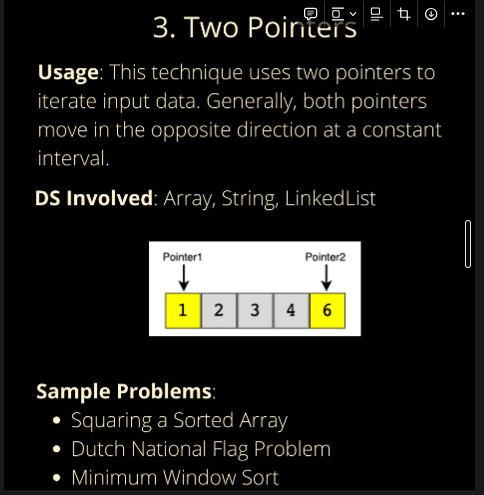
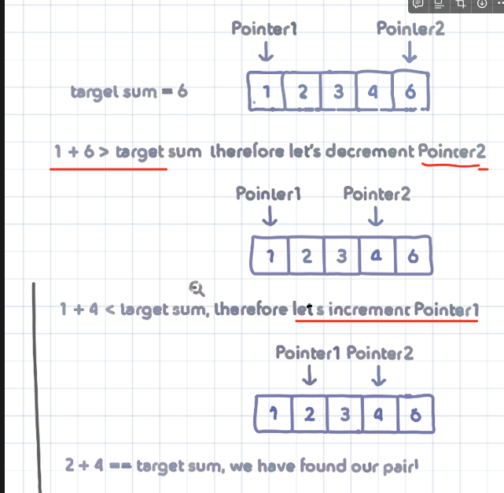

### 2. Two Pointers Or Iterators (sorting, linked list , searching - usually pointer at opposite directions until they met)


this is a pattern where two pointers iterate through the DS in tandem until one or two of them find the answer.


### **Identify**

- problems where we deal with sorted array or linked list, and need to find a set of elements that **fulfil a certain purpose.**
- set of element are **pair, triplet or even subarray**.

### **LeetCode questions**

- squaring a sorted array - easy
- triplet that sum to zero - medium

  Code example : binary search C#

  ```csharp
  // complexity of o(log n) assuming the array is sorted
  public static object BinarySearchDisplay(int[] arr, int key) {
     int minNum = 0;
     int maxNum = arr.Length - 1;

     while (minNum <=maxNum) {
        int mid = (minNum + maxNum) / 2;
        if (key == arr[mid]) {
           return ++mid;
        } else if (key < arr[mid]) {
           max = mid - 1;
        }else {
           min = mid + 1;
        }
     }
     return "None";
  }
  ```

  

  
